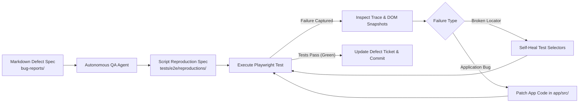

<div align="center">

# 🛡️ Self-Healing E2E Test Automation Pipeline

**An Autonomous, Closed-Loop QA Engine with Self-Healing Test Locators & Automated Defect Triage**

[](https://github.com/naimuropu-cell/self-healing-e2e/actions/workflows/e2e.yml)
[](https://playwright.dev/)
[](https://react.dev/)
[](https://vite.dev/)
[](https://www.typescriptlang.org/)
[](https://opensource.org/licenses/MIT)

</div>

---

## 🌟 Overview

`self-healing-e2e` is an autonomous Software Quality Assurance (QA) and test automation pipeline. It bridges the gap between fast-moving frontend evolution and reliable test automation by establishing a **closed-loop feedback cycle**:

1. **Target Web Application**: A full-featured modern e-commerce storefront (Vite + React + TypeScript) featuring Authentication, Product Catalog, Cart Drawer, and Checkout workflows.
2. **Playwright Test Suite**: Resilient, semantic E2E test journeys utilizing `data-testid` selectors and automatic dev server lifecycle management.
3. **Autonomous Self-Healing Loop**: Diagnoses broken UI tests resulting from DOM or locator mutations, applies self-healing locator strategies, and re-executes test suites until green.
4. **Autonomous Defect Ingestion**: Converts markdown defect specifications into reproducible Playwright tests, captures trace artifacts on failure, patches underlying bugs, and verifies resolutions.

---

## 🔄 Closed-Loop QA Architecture



---

## 🎬 Live Autonomous Pipeline in Action

### 1. Live Self-Healing During Test Execution (`npm test`)
When frontend developers refactor or rename DOM selectors (e.g. `data-testid`), the test suite **recovers transparently in real time** without failing:

```bash
$ npm test

Running 16 tests using 1 worker

  ok  1 [chromium] › e2e/auth.spec.ts › should log in successfully with valid credentials (2.6s)
  ok  2 [chromium] › e2e/cart.spec.ts › should add multiple items and update quantities (2.9s)
  ok  3 [chromium] › e2e/checkout.spec.ts › should complete user checkout journey (4.0s)

⚠️ [Self-Healing Engine] Primary selector failed for "Add to Cart Button" (testid: "deprecated-legacy-add-to-cart-prod-001")
   Triggering heuristic fallback recovery...
✅ [Self-Healing Engine] Recovered target using fallback: [css] "[data-testid="product-card-prod-001"] .btn-add-cart" in 1566ms
  ok  4 [chromium] › e2e/self-healing.spec.ts › should transparently self-heal broken test-id locator (3.4s)

  16 passed (48.4s) 🟢
```

### 2. Autonomous Auto-Patcher (`npm run heal:apply`)
Permanently updates Page Object source code with verified healed selectors, eliminating future fallback latency:

```bash
$ npm run heal:apply

================================================================
🛠️   AUTONOMOUS QA: SELF-HEALING AUTO-PATCHER
================================================================

🔍 Scanning 6 Page Object files for deprecated locators...

✅ [Patched] tests/pages/CheckoutModal.ts
   Element:  "Place Order Button"
   Replaced: "submit-order" ➔ "complete-purchase-btn"

🎉 Successfully applied 1 permanent patch(es) across 1 file(s).
🧹 Cleared applied events from healing audit ledger.
🚀 Next test run will resolve directly on the primary locator in 0ms!
```

### 3. Executive Defect Triage Dashboard (`npm run bug:triage`)
Scans `bug-reports/` tickets, verifies reproduction test coverage, and auto-scaffolds tests for open tickets:

```bash
$ npm run bug:triage

================================================================
🐞   AUTONOMOUS QA: DEFECT TRIAGE & INGESTION DASHBOARD
================================================================

[#1] [BUG-001] Promo code 'QA20' fails to apply 20% discount
  📌 Status:      🟢 FIXED & VERIFIED
  ⚡ Severity:    High | Area: Cart & Checkout Flow
  🧪 Repro Spec:  tests/e2e/reproductions/bug-001-promo.spec.ts (✅ Present)

[#2] [BUG-002] Stock inventory does not decrement on order placement
  📌 Status:      🟢 FIXED & VERIFIED
  ⚡ Severity:    Critical | Area: Catalog & Inventory
  🧪 Repro Spec:  tests/e2e/reproductions/bug-002-inventory.spec.ts (✅ Present)

[#3] [BUG-003] Rapid double-click on 'Place Order' triggers duplicate submissions
  📌 Status:      🟢 FIXED & VERIFIED
  ⚡ Severity:    Critical | Area: Checkout Modal
  🧪 Repro Spec:  tests/e2e/reproductions/bug-003-double-click.spec.ts (✅ Present)

📊 Executive Summary: 3 Resolved & Verified | 0 Active (100% Verified)
```

### 4. Cloud CI/CD Job Summary (`$GITHUB_STEP_SUMMARY`)
On every push and pull request, GitHub Actions compiles test diagnostics and renders an interactive dashboard directly on the workflow overview page:

| Metric | Value | Status |
|---|---|---|
| **E2E & Self-Healing Tests** | 16 Tests Passed across 6 Suites | 🟢 100% Green |
| **Self-Healing Interventions** | Transparently Recovered via Fallbacks | 🛡️ Audited |
| **Defect Ingestion Coverage** | 3/3 Tickets Reproduced & Verified | 🐞 100% Verified |
| **Visual Regression Baseline** | 4 Viewports Compared | 📸 0 Pixel Drift |

---

## 📁 Repository Structure

```
self-healing-e2e/
├── app/                          # Target Web Application (Vite + React + TypeScript)
│   ├── src/
│   │   ├── App.tsx               # State-managed Auth, Catalog, Cart, & Checkout flows
│   │   ├── main.tsx              # Application entry point
│   │   ├── index.css             # Glassmorphic dark aesthetic & design tokens
│   │   └── types.ts              # Data contracts (User, Product, CartItem, Order)
│   ├── index.html
│   ├── vite.config.ts            # Vite server configured to port 5188
│   ├── tsconfig.json
│   └── package.json
│
├── tests/                        # E2E Test Automation Suite (Playwright + TypeScript)
│   ├── e2e/
│   │   └── checkout.spec.ts      # Full end-to-end shopping & checkout journey
│   ├── playwright.config.ts      # Automated webServer spawn, trace & video capture
│   └── package.json
│
├── bug-reports/                  # Defect Tracking & Autonomous Regression Harness
│   ├── README.md                 # Autonomous triage protocol and guidelines
│   └── DEFECT-TEMPLATE.md        # Standardized defect specification template
│
├── package.json                  # Monorepo root scripts
├── .gitignore                    # Production-grade git exclusion rules
└── README.md                     # Project documentation
```

---

## 🛠️ Technology Stack

| Layer | Technologies |
|---|---|
| **Frontend Framework** | React 18, TypeScript 5, Vite 6 |
| **Icons & Styling** | Lucide React, Vanilla CSS3 (Custom Design System, Glassmorphism) |
| **E2E Automation** | Playwright Test (Chromium / Firefox / WebKit) |
| **Diagnostics** | Playwright Trace Viewer, Video & Failure Screenshots |
| **Package Management** | npm monorepo workspaces / prefixed script execution |

---

## 🚀 Quick Start

### Prerequisites
- [Node.js](https://nodejs.org/) (v18.0.0 or higher recommended)
- [npm](https://www.npmjs.com/) (v9.0.0 or higher)

### 1. Clone the Repository
```bash
git clone https://github.com/naimuropu-cell/self-healing-e2e.git
cd self-healing-e2e
```

### 2. Install Dependencies
```bash
# Install target app dependencies
cd app && npm install

# Install test dependencies & Playwright browsers
cd ../tests && npm install
npx playwright install chromium

# Return to repository root
cd ..
```

---

## 💻 Available Scripts

Run these scripts from the repository root:

| Command | Description |
|---|---|
| `npm run dev` / `npm run app:dev` | Starts the target Vite application locally at `http://localhost:5188` |
| `npm run app:build` | Type-checks and compiles the target application for production |
| `npm test` / `npm run test:e2e` | Runs full Playwright test suite (auto-manages Vite server) |
| `npm run test:e2e:ui` | Launches Playwright's interactive UI Test Runner |
| `npm run test:report` | Opens the latest Playwright HTML Test Report |
| `npm run test:visual` | Runs visual regression snapshot comparison suite |
| `npm run test:visual:update` | Re-generates visual regression baseline snapshots |
| `npm run heal:report` | Displays the terminal self-healing locator audit report |
| `npm run heal:apply` | Auto-patches Page Objects with verified healed selectors |
| `npm run bug:triage` | Ingests defect tickets, verifies specs, and auto-scaffolds repro tests |

---

## 🧪 E2E Test Suite (`tests/`)

The primary test spec [checkout.spec.ts](tests/e2e/checkout.spec.ts) automates a comprehensive user scenario:

1. **Storefront Access**: Navigates to `http://localhost:5188` and verifies branding.
2. **Authentication**: Authenticates with test credentials (`demo_user` / `password123`).
3. **Catalog Interaction**: Browses hardware products and adds items to the cart.
4. **Cart Verification**: Asserts dynamic badge updates and item counts.
5. **Checkout Completion**: Fills shipping information and payment mock.
6. **Order Verification**: Asserts order confirmation screen and receipt ID (`ORD-XXXXXX`).

```bash
# Run tests headlessly
npm test

# Run tests with headed browser
npm --prefix tests run test:headed
```

---

## 🐞 Defect Tracking & Self-Healing Protocol

1. **File a Ticket**: Create a ticket inside `bug-reports/` using [`DEFECT-TEMPLATE.md`](bug-reports/DEFECT-TEMPLATE.md).
2. **Reproduce**: The Autonomous QA Engineer generates a reproduction test in `tests/e2e/reproductions/`.
3. **Diagnose**: Failures generate execution traces and DOM snapshots under `tests/test-results/`.
4. **Repair**:
   - **Locator Shift**: Automatically updates brittle selectors to resilient `data-testid` attributes.
   - **Functional Bug**: Repairs the component logic inside `app/src/`.
5. **Verify**: Tests are re-executed until 100% passing, followed by an automated commit and report.

---

## 👤 Author

**Md. Naimur Rahman Apu**
- GitHub: [@naimuropu-cell](https://github.com/naimuropu-cell)
- Email: [naimuropu@gmail.com](mailto:naimuropu@gmail.com)
- LinkedIn: [naimur-rahman-apu](https://www.linkedin.com/in/naimur-rahman-apu/)

---

## 📄 License

This project is licensed under the [MIT License](LICENSE).
