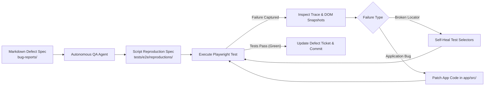
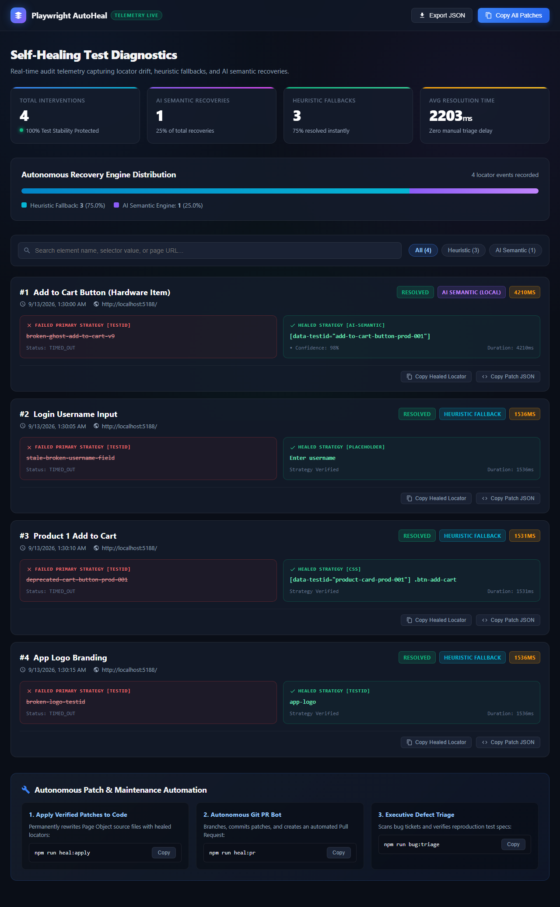

<div align="center">

# 🛡️ Self-Healing E2E Test Automation Pipeline

**An Autonomous, Closed-Loop QA Engine with Self-Healing Test Locators & Automated Defect Triage**

[](https://github.com/naimuropu-cell/self-healing-e2e/actions/workflows/e2e.yml)
[](https://playwright.dev/)
[](https://react.dev/)
[](https://vite.dev/)
[](https://www.typescriptlang.org/)
[](https://opensource.org/licenses/MIT)

</div>

---

## 🌟 Overview

`self-healing-e2e` is an autonomous Software Quality Assurance (QA) and test automation pipeline. It bridges the gap between fast-moving frontend evolution and reliable test automation by establishing a **closed-loop feedback cycle**:

1. **Target Web Application**: A full-featured modern e-commerce storefront (Vite + React + TypeScript) featuring Authentication, Product Catalog, Cart Drawer, and Checkout workflows.
2. **Playwright Test Suite**: Resilient, semantic E2E test journeys utilizing `data-testid` selectors and automatic dev server lifecycle management.
3. **Autonomous Self-Healing Loop**: Diagnoses broken UI tests resulting from DOM or locator mutations, applies self-healing locator strategies, and re-executes test suites until green.
4. **Autonomous Defect Ingestion**: Converts markdown defect specifications into reproducible Playwright tests, captures trace artifacts on failure, patches underlying bugs, and verifies resolutions.

---

## 🔄 Closed-Loop QA Architecture



---

## 🎬 Live Autonomous Pipeline in Action

### 1. Live Self-Healing During Test Execution (`npm test`)
When frontend developers refactor or rename DOM selectors (e.g. `data-testid`), the test suite **recovers transparently in real time** without failing:

```bash
$ npm test

Running 16 tests using 1 worker

  ok  1 [chromium] › e2e/auth.spec.ts › should log in successfully with valid credentials (2.6s)
  ok  2 [chromium] › e2e/cart.spec.ts › should add multiple items and update quantities (2.9s)
  ok  3 [chromium] › e2e/checkout.spec.ts › should complete user checkout journey (4.0s)

⚠️ [Self-Healing Engine] Primary selector failed for "Add to Cart Button" (testid: "deprecated-legacy-add-to-cart-prod-001")
   Triggering heuristic fallback recovery...
✅ [Self-Healing Engine] Recovered target using fallback: [css] "[data-testid="product-card-prod-001"] .btn-add-cart" in 1566ms
  ok  4 [chromium] › e2e/self-healing.spec.ts › should transparently self-heal broken test-id locator (3.4s)

  16 passed (48.4s) 🟢
```

### 2. Autonomous Auto-Patcher (`npm run heal:apply`)
Permanently updates Page Object source code with verified healed selectors, eliminating future fallback latency:

```bash
$ npm run heal:apply

================================================================
🛠️   AUTONOMOUS QA: SELF-HEALING AUTO-PATCHER
================================================================

🔍 Scanning 6 Page Object files for deprecated locators...

✅ [Patched] tests/pages/CheckoutModal.ts
   Element:  "Place Order Button"
   Replaced: "submit-order" ➔ "complete-purchase-btn"

🎉 Successfully applied 1 permanent patch(es) across 1 file(s).
🧹 Cleared applied events from healing audit ledger.
🚀 Next test run will resolve directly on the primary locator in 0ms!
```

### 3. Executive Defect Triage Dashboard (`npm run bug:triage`)
Scans `bug-reports/` tickets, verifies reproduction test coverage, and auto-scaffolds tests for open tickets:

```bash
$ npm run bug:triage

================================================================
🐞   AUTONOMOUS QA: DEFECT TRIAGE & INGESTION DASHBOARD
================================================================

[#1] [BUG-001] Promo code 'QA20' fails to apply 20% discount
  📌 Status:      🟢 FIXED & VERIFIED
  ⚡ Severity:    High | Area: Cart & Checkout Flow
  🧪 Repro Spec:  tests/e2e/reproductions/bug-001-promo.spec.ts (✅ Present)

[#2] [BUG-002] Stock inventory does not decrement on order placement
  📌 Status:      🟢 FIXED & VERIFIED
  ⚡ Severity:    Critical | Area: Catalog & Inventory
  🧪 Repro Spec:  tests/e2e/reproductions/bug-002-inventory.spec.ts (✅ Present)

[#3] [BUG-003] Rapid double-click on 'Place Order' triggers duplicate submissions
  📌 Status:      🟢 FIXED & VERIFIED
  ⚡ Severity:    Critical | Area: Checkout Modal
  🧪 Repro Spec:  tests/e2e/reproductions/bug-003-double-click.spec.ts (✅ Present)

📊 Executive Summary: 3 Resolved & Verified | 0 Active (100% Verified)
```

### 4. Cloud CI/CD Job Summary (`$GITHUB_STEP_SUMMARY`)
On every push and pull request, GitHub Actions compiles test diagnostics and renders an interactive dashboard directly on the workflow overview page:

| Metric | Value | Status |
|---|---|---|
| **E2E & Self-Healing Tests** | 20 Tests Passed across 8 Suites (including AI Recovery & Fixtures) | 🟢 100% Green |
| **Self-Healing Interventions** | Transparently Recovered via Fallbacks | 🛡️ Audited |
| **Defect Ingestion Coverage** | 3/3 Tickets Reproduced & Verified | 🐞 100% Verified |
| **Visual Regression Baseline** | 4 Viewports Compared | 📸 0 Pixel Drift |

### 5. Automated Pull Request Bot (`npm run heal:pr`)
A fully autonomous maintenance agent that bridges runtime locator healing with Git version control. On nightly schedules or manual invocation, the bot tests the app, heals stale Page Object selectors, branches off `main`, commits changes, pushes the branch, and opens an automated Pull Request:

```bash
$ npm run heal:pr

================================================================
🤖  AUTONOMOUS QA: AUTOMATED PULL REQUEST BOT (heal:pr)
================================================================

1️⃣  Executing heal-patcher on Page Objects...
✅ [Patched] tests/pages/LoginPage.ts
   Element:  "Login Username Input"
   Replaced: "broken-username-v2" ➔ "login-username"

2️⃣  Detected 1 modified Page Object file(s):
   - tests/pages/LoginPage.ts

3️⃣  Current branch: main. Creating branch 'auto-heal/selectors-2026-09-10t00-58-12'...
✅ Changes committed to 'auto-heal/selectors-2026-09-10t00-58-12'.

4️⃣  Pushing 'auto-heal/selectors-2026-09-10t00-58-12' to origin...
✅ Successfully pushed 'auto-heal/selectors-2026-09-10t00-58-12' to remote.

5️⃣  Resolving Pull Request options...
🎉  AUTOMATED PULL REQUEST BRANCH READY ON GITHUB
🔗 Open this link in your browser to review and merge your PR:
   https://github.com/naimuropu-cell/self-healing-e2e/compare/main...auto-heal/selectors-2026-09-10t00-58-12?expand=1
```

> 🤖 **Nightly Autonomous Maintenance**: Configured in [`.github/workflows/auto-heal-pr.yml`](.github/workflows/auto-heal-pr.yml) to run daily at 03:00 UTC, automatically submitting PRs labeled `self-healing` and `qa-maintenance` whenever front-end code evolves.

### 6. Decoupled Standalone NPM Package (`packages/playwright-autoheal`)
The core self-healing locator engine is decoupled into a standalone, installable TypeScript library under [`packages/playwright-autoheal/`](packages/playwright-autoheal/) that any engineering team can add to any Playwright project:

```typescript
import { test } from '@playwright/test';
import { SelfHealingEngine, SelfHealingDescriptor } from 'playwright-autoheal';

test('resilient interaction across any project', async ({ page }) => {
  const submitDescriptor: SelfHealingDescriptor = {
    name: 'Submit Button',
    primary: { type: 'testid', value: 'primary-submit' },
    fallbacks: [
      { type: 'role', value: 'button', options: { name: /submit/i } },
      { type: 'css', value: '.btn-submit-action' }
    ]
  };

  await SelfHealingEngine.click(page, submitDescriptor);
});
```

- **Compiled Output**: Ready-to-publish ES2022/CommonJS builds with full TypeScript `.d.ts` declaration maps.
- **Built-in CLI**: Run `npx playwright-autoheal report` or `npx playwright-autoheal patch` directly in any project.

### 7. AI-Powered Semantic Locator Recovery (`tests/e2e/ai-healing.spec.ts`)
When all conventional and programmatic fallbacks are exhausted (e.g. completely renamed test-ids, restructured CSS, and missing ARIA labels), `playwright-autoheal` engages **Phase 3 AI Semantic Recovery**:

```bash
⚠️ [Self-Healing Engine] Primary selector failed for "Add to Cart Button (Hardware Item)" (testid: "broken-ghost-add-to-cart-v9"). Triggering fallback heuristics...
🤖 [AI Semantic Recovery] Initiating AI locator inference for "Add to Cart Button (Hardware Item)"...
🧠 [AI Semantic Recovery] Successfully inferred and verified target for "Add to Cart Button (Hardware Item)" via ai-local ([data-testid="add-to-cart-button-prod-001"], confidence: 98%) in 64ms
  ok 1 [chromium] › e2e/ai-healing.spec.ts › should recover element using AI semantic inference (10.2s)
```

- **Dual-Engine Architecture**:
  - **Remote LLMs**: Seamlessly connect to Google Gemini (`GEMINI_API_KEY`) or OpenAI (`OPENAI_API_KEY`) for visual & DOM reasoning.
  - **Embedded Local Semantic Engine**: Zero-dependency token similarity, contextual relevance ranking, and interactive role weighting that operates offline and in CI/CD without API keys.

### 8. Custom Playwright Fixture & Transparent Proxy (`tests/e2e/fixture.spec.ts`)
For teams that prefer idiomatic Playwright test syntax over explicit utility wrappers, `playwright-autoheal` provides an extended test fixture (`extendWithAutoHeal`) and transparent page proxy (`autoheal`):

```typescript
import { test as base, expect } from '@playwright/test';
import { extendWithAutoHeal, SelfHealingDescriptor } from 'playwright-autoheal';

const test = extendWithAutoHeal(base);

test('zero-boilerplate resilient interaction', async ({ autoheal }) => {
  await autoheal.goto('/');

  // Pass either SelfHealingDescriptors or native selectors:
  await autoheal.fill(usernameDescriptor, 'testuser');
  await autoheal.click(loginBtnDescriptor);

  // Directly obtain a resilient Playwright Locator:
  const cartBtn = await autoheal.heal(addToCartDescriptor);
  await expect(cartBtn).toBeVisible();
});
```

- **Seamless Proxy**: Inherits all standard Playwright `Page` methods (`goto`, `waitForURL`, `getByTestId`, `screenshot`, etc.) while automatically routing descriptor targets through `SelfHealingEngine`.
- **Zero Configuration**: Ready to drop into existing test suites with standard Playwright runners.

---

### 9. Interactive HTML Self-Healing Visual Dashboard (`npm run heal:dashboard`)

<p align="center">
  
</p>
Generates a standalone, dark glassmorphic HTML telemetry dashboard for visual auditing of selector drifts, recovery latency, and AI semantic interventions:

```bash
# Generate dashboard and open in browser
npm run heal:dashboard
```

- **Executive KPI Cards**: Real-time totals for interventions, AI semantic recoveries, heuristic fallbacks, and average resolution latency.
- **Recovery Engine Distribution**: Visual gradient breakdown comparing heuristic fallback recoveries against AI-powered semantic recoveries.
- **Side-by-Side Visual Diff**: Inspects broken primary selectors (strikethrough) alongside healed locators with resolution duration and confidence scores.
- **Interactive Search & Filter**: Instant client-side search by element name or selector value, plus filter chips to isolate AI vs. heuristic recoveries.
- **Actionable Maintenance Hub**: One-click code copy buttons for individual healed locators, full patch JSON, or running autonomous git patch workflows.


---

### 10. Locator Fragility & Health Scoring Analyzer (`npm run heal:health`)
Statically audits all Page Objects and test specifications, evaluating selector stability against industry best practices. Generates an executive resilience grade (`A+` to `F`) and flags high-risk brittle selectors before they break in CI:

```bash
# Audit repository locators
npm run heal:health

# Strict CI validation (fails on critical brittle locators)
npx playwright-autoheal health --strict

# Machine-readable JSON telemetry
npx playwright-autoheal health --json
```

```
================================================================
🏥   AUTONOMOUS QA: LOCATOR HEALTH & FRAGILITY AUDIT
================================================================

Overall Health Score : 99/100  [Grade: A+]
Total Locators Scanned: 32
Audited Directories  : tests/pages

Breakdown by Resilience Tier:
  🟢 Excellent (90-100%) : 31
  🔵 Good      (75-89%)  : 1
  🟡 Moderate  (50-74%)  : 0
  🟠 Brittle   (25-49%)  : 0
  🔴 Critical  (0-24%)   : 0

🎉 Outstanding! Zero brittle or high-risk locators found across your test suite.
```

- **Heuristic Rubric**: Scores locators from 0 to 100% based on semantic stability (`data-testid` = 100%, `role` = 94%, `label`/`placeholder` = 88%, multi-strategy descriptors = +10 bonus).
- **Fragility Detection**: Flags deep CSS hierarchies (`div > form > button`), positional indices (`:nth-child`), dynamic build hashes, and absolute XPath.
- **Actionable Fix Guidance**: Provides targeted recommendations to upgrade brittle selectors to resilient test IDs or self-healing descriptors.


---

## 📁 Repository Structure

```
self-healing-e2e/
├── packages/
│   └── playwright-autoheal/      # Decoupled Standalone NPM Package (TypeScript + CLI)
│       ├── src/
│       │   ├── engine.ts         # Multi-strategy locator resolution & audit recording
│       │   ├── patcher.ts        # Source code auto-patcher for Page Objects
│       │   ├── reporter.ts       # CLI terminal audit reporting utility
│       │   └── types.ts          # Core data contracts & configuration schemas
│       ├── dist/                 # Compiled JavaScript and .d.ts type declarations
│       ├── package.json          # Independent library metadata & peer dependencies
│       └── README.md             # Package documentation & standalone quickstart
│
├── app/                          # Target Web Application (Vite + React + TypeScript)
│   ├── src/
│   │   ├── App.tsx               # State-managed Auth, Catalog, Cart, & Checkout flows
│   │   ├── main.tsx              # Application entry point
│   │   ├── index.css             # Glassmorphic dark aesthetic & design tokens
│   │   └── types.ts              # Data contracts (User, Product, CartItem, Order)
│   ├── index.html
│   ├── vite.config.ts            # Vite server configured to port 5188
│   ├── tsconfig.json
│   └── package.json
│
├── tests/                        # E2E Test Automation Suite (Playwright + TypeScript)
│   ├── e2e/
│   │   ├── checkout.spec.ts      # Full end-to-end shopping & checkout journey
│   │   ├── self-healing.spec.ts  # Live resilience & mutation recovery test suite
│   │   └── visual.spec.ts        # Visual regression baseline snapshot suite
│   ├── pages/                    # Page Object Model abstraction layer
│   ├── playwright.config.ts      # Automated webServer spawn, trace & video capture
│   └── package.json              # Consumes 'playwright-autoheal' directly
│
├── bug-reports/                  # Defect Tracking & Autonomous Regression Harness
│   ├── README.md                 # Autonomous triage protocol and guidelines
│   └── DEFECT-TEMPLATE.md        # Standardized defect specification template
│
├── package.json                  # Monorepo root scripts
├── .gitignore                    # Production-grade git exclusion rules
└── README.md                     # Project documentation
```

---

## 🛠️ Technology Stack

| Layer | Technologies |
|---|---|
| **Frontend Framework** | React 18, TypeScript 5, Vite 6 |
| **Icons & Styling** | Lucide React, Vanilla CSS3 (Custom Design System, Glassmorphism) |
| **E2E Automation** | Playwright Test (Chromium / Firefox / WebKit) |
| **Diagnostics** | Playwright Trace Viewer, Video & Failure Screenshots |
| **Package Management** | npm monorepo workspaces / prefixed script execution |

---

## 🚀 Quick Start

### Prerequisites
- [Node.js](https://nodejs.org/) (v18.0.0 or higher recommended)
- [npm](https://www.npmjs.com/) (v9.0.0 or higher)

### 1. Clone the Repository
```bash
git clone https://github.com/naimuropu-cell/self-healing-e2e.git
cd self-healing-e2e
```

### 2. Install Dependencies
```bash
# Install target app dependencies
cd app && npm install

# Install test dependencies & Playwright browsers
cd ../tests && npm install
npx playwright install chromium

# Return to repository root
cd ..
```

---

## 💻 Available Scripts

Run these scripts from the repository root:

| Command | Description |
|---|---|
| `npm run dev` / `npm run app:dev` | Starts the target Vite application locally at `http://localhost:5188` |
| `npm run app:build` | Type-checks and compiles the target application for production |
| `npm run package:build` | Compiles TypeScript and builds `dist/` for decoupled `playwright-autoheal` package |
| `npm test` / `npm run test:e2e` | Runs full Playwright test suite (auto-manages Vite server) |
| `npm run test:e2e:ui` | Launches Playwright's interactive UI Test Runner |
| `npm run test:report` | Opens the latest Playwright HTML Test Report |
| `npm run test:visual` | Runs visual regression snapshot comparison suite |
| `npm run test:visual:update` | Re-generates visual regression baseline snapshots |
| `npm run heal:report` | Displays the terminal self-healing locator audit report |
| `npm run heal:dashboard` | Generates and opens interactive visual HTML telemetry dashboard |
| `npm run heal:health` | Statically audits selector resilience and flags brittle locators |
| `npm run heal:apply` | Auto-patches Page Objects with verified healed selectors |
| `npm run heal:pr` | Automatically creates branch, commits healed selectors, and opens GitHub PR |
| `npm run bug:triage` | Ingests defect tickets, verifies specs, and auto-scaffolds repro tests |

---

## 🧪 E2E Test Suite (`tests/`)

The primary test spec [checkout.spec.ts](tests/e2e/checkout.spec.ts) automates a comprehensive user scenario:

1. **Storefront Access**: Navigates to `http://localhost:5188` and verifies branding.
2. **Authentication**: Authenticates with test credentials (`demo_user` / `password123`).
3. **Catalog Interaction**: Browses hardware products and adds items to the cart.
4. **Cart Verification**: Asserts dynamic badge updates and item counts.
5. **Checkout Completion**: Fills shipping information and payment mock.
6. **Order Verification**: Asserts order confirmation screen and receipt ID (`ORD-XXXXXX`).

```bash
# Run tests headlessly
npm test

# Run tests with headed browser
npm --prefix tests run test:headed
```

---

## 🐞 Defect Tracking & Self-Healing Protocol

1. **File a Ticket**: Create a ticket inside `bug-reports/` using [`DEFECT-TEMPLATE.md`](bug-reports/DEFECT-TEMPLATE.md).
2. **Reproduce**: The Autonomous QA Engineer generates a reproduction test in `tests/e2e/reproductions/`.
3. **Diagnose**: Failures generate execution traces and DOM snapshots under `tests/test-results/`.
4. **Repair**:
   - **Locator Shift**: Automatically updates brittle selectors to resilient `data-testid` attributes.
   - **Functional Bug**: Repairs the component logic inside `app/src/`.
5. **Verify**: Tests are re-executed until 100% passing, followed by an automated commit and report.

---

## 👤 Author

**Md. Naimur Rahman Apu**
- GitHub: [@naimuropu-cell](https://github.com/naimuropu-cell)
- Email: [naimuropu@gmail.com](mailto:naimuropu@gmail.com)
- LinkedIn: [naimur-rahman-apu](https://www.linkedin.com/in/naimur-rahman-apu/)

---

## 📄 License

This project is licensed under the [MIT License](LICENSE).
